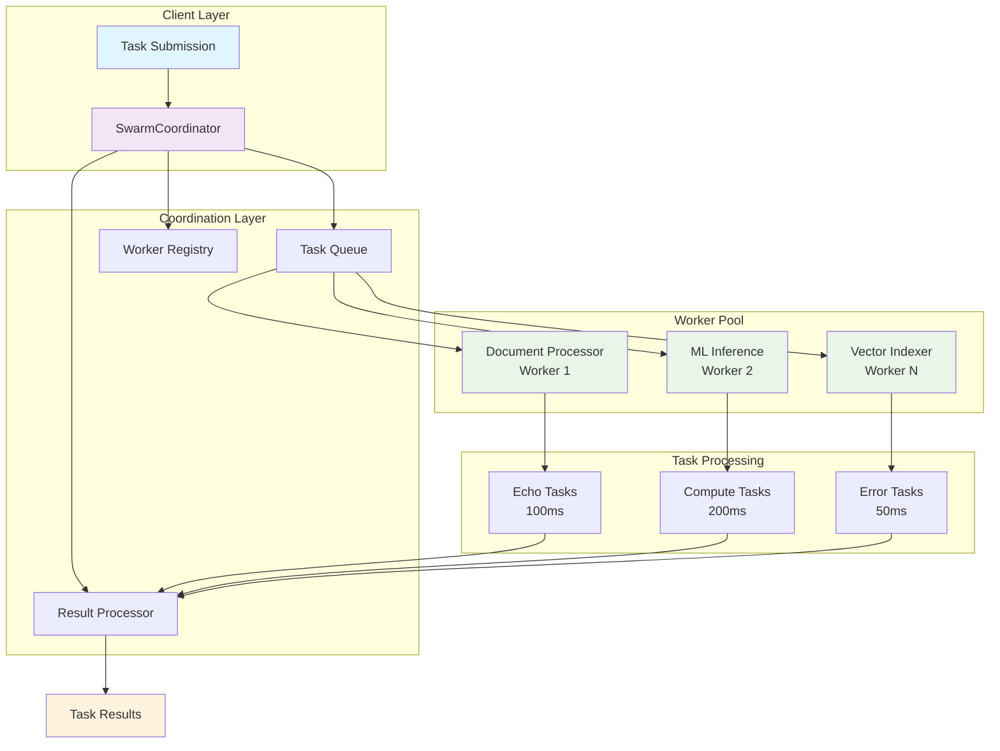
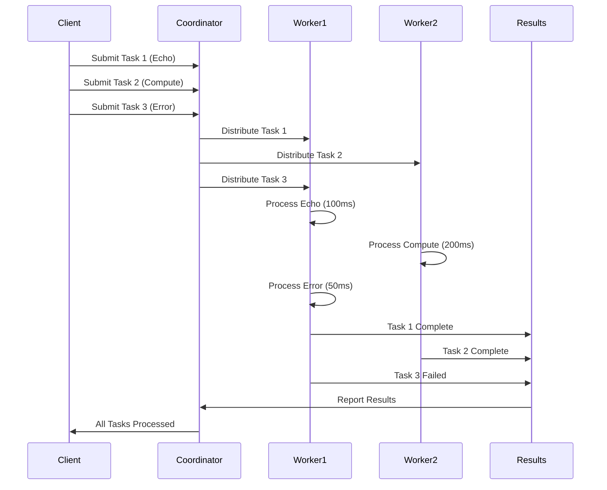
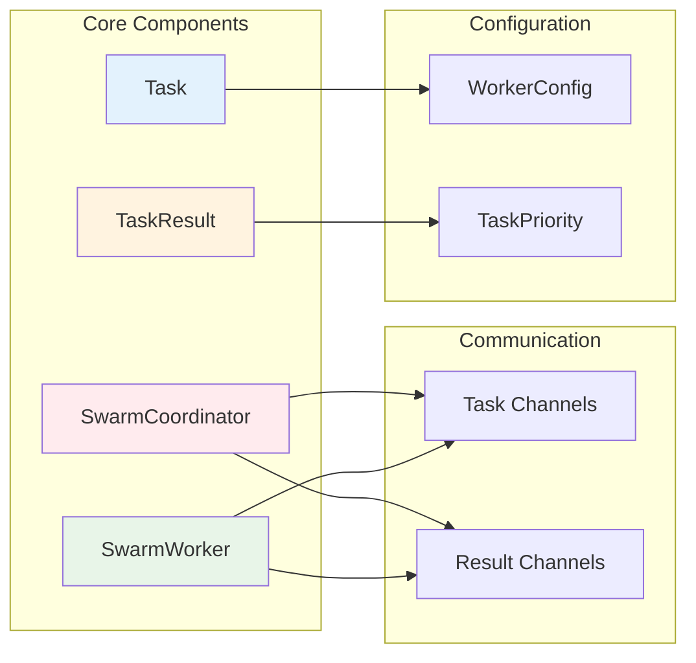

# Aprio Swarm System Architecture

## System Flow Diagram

```mermaid
graph TB
    subgraph "Client Layer"
        A[Task Submission] --> B[SwarmCoordinator]
    end
    
    subgraph "Coordination Layer"
        B --> C[Task Queue]
        B --> D[Worker Registry]
        B --> E[Result Processor]
    end
    
    subgraph "Worker Pool"
        F[Document Processor<br/>Worker 1]
        G[ML Inference<br/>Worker 2]
        H[Vector Indexer<br/>Worker N]
    end
    
    subgraph "Task Processing"
        I[Echo Tasks<br/>100ms]
        J[Compute Tasks<br/>200ms]
        K[Error Tasks<br/>50ms]
    end
    
    C --> F
    C --> G
    C --> H
    
    F --> I
    G --> J
    H --> K
    
    I --> E
    J --> E
    K --> E
    
    E --> L[Task Results]
    
    style A fill:#e1f5fe
    style B fill:#f3e5f5
    style F fill:#e8f5e8
    style G fill:#e8f5e8
    style H fill:#e8f5e8
    style L fill:#fff3e0
```

## Task Flow Visualization

```mermaid
sequenceDiagram
    participant Client
    participant Coordinator
    participant Worker1
    participant Worker2
    participant Results
    
    Client->>Coordinator: Submit Task 1 (Echo)
    Client->>Coordinator: Submit Task 2 (Compute)
    Client->>Coordinator: Submit Task 3 (Error)
    
    Coordinator->>Worker1: Distribute Task 1
    Coordinator->>Worker2: Distribute Task 2
    Coordinator->>Worker1: Distribute Task 3
    
    Worker1->>Worker1: Process Echo (100ms)
    Worker2->>Worker2: Process Compute (200ms)
    Worker1->>Worker1: Process Error (50ms)
    
    Worker1->>Results: Task 1 Complete
    Worker2->>Results: Task 2 Complete
    Worker1->>Results: Task 3 Failed
    
    Results->>Coordinator: Report Results
    Coordinator->>Client: All Tasks Processed
```

## Performance Metrics

```mermaid
gantt
    title Task Processing Timeline
    dateFormat X
    axisFormat %L ms
    
    section Worker 1
    Echo Task 1    :done, task1, 0, 102
    Error Task     :done, task3, 102, 152
    
    section Worker 2
    Compute Task 1 :done, task2, 0, 200
    Compute Task 2 :done, task5, 200, 401
```

## System Components

```mermaid
graph LR
    subgraph "Core Components"
        A[SwarmCoordinator]
        B[SwarmWorker]
        C[Task]
        D[TaskResult]
    end
    
    subgraph "Communication"
        E[Task Channels]
        F[Result Channels]
    end
    
    subgraph "Configuration"
        G[WorkerConfig]
        H[TaskPriority]
    end
    
    A --> E
    A --> F
    B --> E
    B --> F
    C --> G
    D --> H
    
    style A fill:#ffebee
    style B fill:#e8f5e8
    style C fill:#e3f2fd
    style D fill:#fff3e0
```
