# Worker Architecture: Current vs. Improved

## 🔄 Current Architecture (Problems)

```mermaid
graph TB
    subgraph "Current System - Any Worker, Any Task"
        A[Task Queue] --> B[Round-Robin Distribution]
        B --> C[Worker 1: Document Processor]
        B --> D[Worker 2: ML Inference]
        B --> E[Worker N: Vector Indexer]
        
        F[ML Task] --> B
        G[Document Task] --> B
        H[Vector Task] --> B
        
        C --> I[❌ ML Task on Document Worker]
        D --> J[❌ Document Task on ML Worker]
        E --> K[❌ Vector Task on Random Worker]
    end
    
    style I fill:#ffebee
    style J fill:#ffebee
    style K fill:#ffebee
```

## ✅ Improved Architecture (Solution)

```mermaid
graph TB
    subgraph "Improved System - Capability-Based Matching"
        A[Task Queue] --> B[Intelligent Task Assignment]
        
        subgraph "Task Analysis"
            C[Task Requirements]
            D[Required Capabilities]
            E[Performance Needs]
        end
        
        subgraph "Worker Matching"
            F[Capability Matching]
            G[Performance Scoring]
            H[Load Balancing]
        end
        
        B --> C
        C --> D
        C --> E
        D --> F
        E --> G
        F --> H
        G --> H
        
        H --> I[✅ ML Task → ML Worker]
        H --> J[✅ Document Task → Document Worker]
        H --> K[✅ Vector Task → Vector Worker]
    end
    
    style I fill:#e8f5e8
    style J fill:#e8f5e8
    style K fill:#e8f5e8
```

## 🎯 Worker Specialization Matrix

## 📊 Performance Comparison

## 🔧 Implementation Phases

## 🎯 Key Improvements

### **1. Capability-Based Assignment**
- Tasks matched to workers based on required capabilities
- No more random task distribution
- Optimal resource utilization

### **2. Worker Specialization**
- Each worker type optimized for specific tasks
- Better performance and efficiency
- Easier to scale and maintain

### **3. Intelligent Load Balancing**
- Consider worker performance profiles
- Balance based on current load
- Dynamic task routing

### **4. Extensibility**
- Easy to add new worker types
- Simple capability system
- Flexible task requirements
